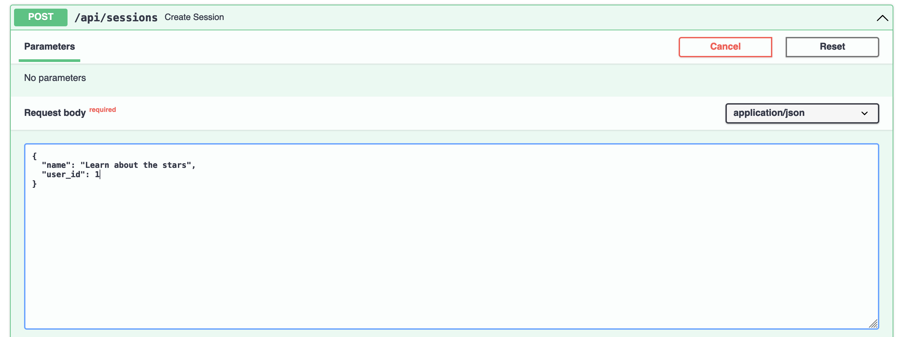
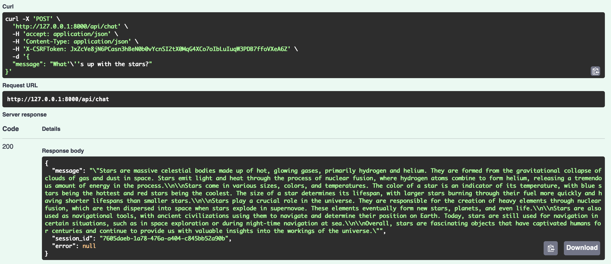
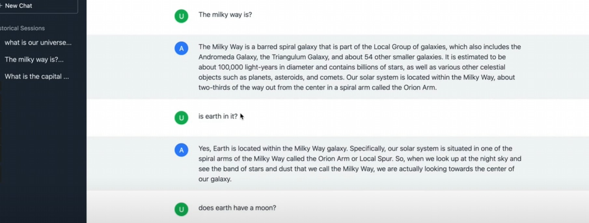
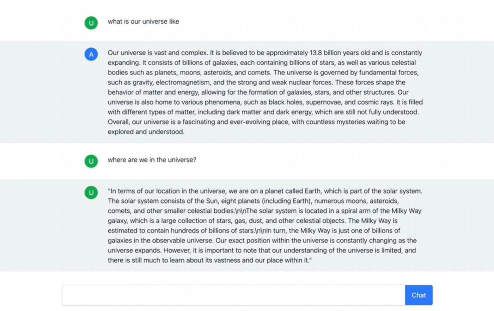

# Personal Chatbot

A Personal Chatbot built with Django for the backend, React for the frontend, and powered by OpenAI's GPT-4. This application allows users to have secure and private conversations with an AI model.

## Table of Contents

- [Features](#features)
- [Technologies Used](#technologies-used)
- [Installation](#installation)
- [Usage](#usage)
- [License](#license)

## Features

- Secure and private chat interface
- User authentication and management
- Customizable AI response settings
- Chat History
- Real-time messaging
- Responsive design for mobile and desktop

## Technologies Used

- **Backend:** Django, Django REST Framework, Django-ninja APIs
- **Frontend:** React, Redux
- **AI Model:** OpenAI's GPT-4
- **Database:** PostgreSQL

## Installation

### Prerequisites

- Python
- Node.js and npm
- PostgreSQL (or your preferred database)
- OpenAI API key

### Backend Setup

1. Clone the repository:
   ```bash
   git clone https://github.com/fazil-shaikh/personal-chatbot
   cd .\ai-chatbot\django\
   ```
2. Create a virtual environment and activate it:
    ```bash
    python -m venv venv
    source venv/bin/activate  # On Windows use `venv\Scripts\activate`
    ```
3. Install the backend dependencies:
    ```bash
    pip install -r requirements.txt
    ```
4. Configure your database in settings.py and migrate:
    ```bash
    python manage.py migrate
    ```
5. Create a superuser:
    ```bash
    python manage.py createsuperuser
    ```
6. Start the Django server:
    ```bash
    python manage.py runserver
    ```
7. Open http://127.0.0.1:8000/admin/ and login with the superuser credentials you created previously (refer above)
8. Open http://127.0.0.1:8000/api/docs
9. Test the Endpoints
   
### Frontend Setup

1. Navigate to the frontend directory:
    ```bash
    cd ../react
    ```
2. Install the frontend dependencies:
    ```bash
    npm install
    ```
3. Run the Vite dev server::
    ```bash
    npm run dev
    ```
4. Take note of the Local: http://localhost:XXXX/ value and add it to the bottom of `./django/config/settings.py` file.
## Usage
1. Open a browser for your Vite/React dev server. For example, http://localhost:XXXX.
2. Login using the http://localhost:XXXX/login link and the superuser you created on Django.
3. Now go to your root URL of http://localhost:XXXX and start chatting with the AI!

## Screenshots

### Backend: 
   
   

### Frontend: 
   
   
   
   
## License

This project is licensed under the MIT License. See the [LICENSE](LICENSE) file for details.

---
